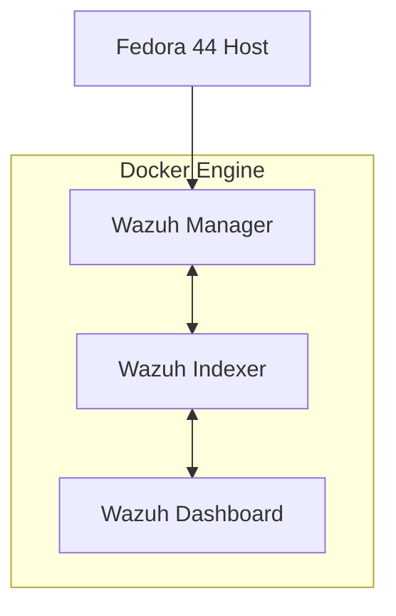

# 05 - Wazuh Deployment

## Objective

This phase deploys a fully functional Wazuh Security Information and Event Management (SIEM) platform using the official Wazuh Docker deployment. The objective is to establish a secure, reproducible, and maintainable monitoring environment that serves as the foundation for endpoint monitoring, detection engineering, threat hunting, and incident response exercises.

Rather than installing Wazuh directly on the Fedora host, the platform is deployed in Docker containers to improve isolation, portability, maintainability, and reproducibility while preserving the security posture of the workstation.

---

# Deployment Architecture

The deployment uses Wazuh's official **single-node** architecture.



---

# Deployment Timeline

```text
Host Preparation
        │
        ▼
Docker Installation
        │
        ▼
Clone Official Wazuh Repository
        │
        ▼
Generate TLS Certificates
        │
        ▼
Resolve SELinux Issue
        │
        ▼
Deploy Wazuh Containers
        │
        ▼
Validate Services
        │
        ▼
Access Dashboard
        │
        ▼
Ready for Agent Enrollment
```

---

# Environment

| Component         | Value                                |
| ----------------- | ------------------------------------ |
| Operating System  | Fedora Linux 44 (KDE Plasma Desktop) |
| Processor         | Intel Core i5-6200U                  |
| Memory            | 8 GB RAM                             |
| Deployment Type   | Official Wazuh Docker                |
| Architecture      | Single Node                          |
| Container Runtime | Docker Engine                        |
| Orchestration     | Docker Compose                       |
| SELinux           | Enforcing                            |

---

# Why Docker?

Instead of installing Wazuh directly on the host operating system, Docker was selected for several reasons:

* Better isolation between services
* Reproducible deployments
* Simplified upgrades
* Easier rollback capability
* Minimal impact on the Fedora workstation
* Version-controlled infrastructure
* Alignment with modern DevSecOps practices

This approach allows the entire environment to be recreated on another system using only the repository documentation.

---

# Deployment Source

The deployment uses the official Wazuh Docker repository.

Repository:

https://github.com/wazuh/wazuh-docker

Deployment mode:

* Official Single-Node Deployment

The vendor repository is maintained separately from the project documentation to simplify future upgrades and minimize divergence from upstream.


---

# Components

## Wazuh Manager

Responsibilities include:

* Agent enrollment
* Log collection
* Event analysis
* Rule processing
* Alert generation
* Active Response
* File Integrity Monitoring (FIM)
* Vulnerability Detection

---

## Wazuh Indexer

The Indexer is responsible for:

* Indexing security events
* Event storage
* Fast searching
* Providing data for dashboards

---

## Wazuh Dashboard

The Dashboard provides:

* Alert investigation
* Agent management
* Security dashboards
* Threat hunting
* Visualization
* Platform administration

---

# Deployment Procedure

The deployment followed the official Wazuh Docker installation process.

## Clone the Repository

The official Wazuh Docker repository was cloned independently of the project repository.

```bash
git clone https://github.com/wazuh/wazuh-docker.git
```

---

## Generate TLS Certificates

Communication between platform components is encrypted using TLS.

Certificates were generated using the official certificate generator.

```bash
docker compose -f generate-indexer-certs.yml run --rm generator
```

Certificates were generated for:

* Root Certificate Authority
* Wazuh Manager
* Wazuh Indexer
* Wazuh Dashboard
* Administrative user

---

## Deploy the Platform

The Wazuh platform was deployed using Docker Compose.

```bash
docker compose up -d
```

Docker created and started:

* Wazuh Manager
* Wazuh Indexer
* Wazuh Dashboard

---

# Fedora SELinux Challenge

Certificate generation initially failed with the following error:

```text
cp: cannot stat '/config/certs.yml': Permission denied

ERROR: No configuration file found
```

Although the configuration file existed on the host, the container could not read it.

---

# Root Cause Analysis

Fedora enables SELinux in **Enforcing** mode by default.

The deployment directory resided inside the user's home directory, where files were labeled:

```text
user_home_t
```

Docker containers execute using the SELinux domain:

```text
container_t
```

This prevented the certificate-generation container from accessing the mounted configuration file.

The issue was confirmed using:

```bash
sudo ausearch -m AVC -ts recent
```

The audit log reported:

```text
avc: denied { read }

scontext=system_u:system_r:container_t

tcontext=unconfined_u:object_r:user_home_t
```

This confirmed that the issue was caused by SELinux policy enforcement rather than traditional UNIX file permissions.

---

# Resolution

Rather than disabling SELinux, the deployment directory was relabeled for container access.

```bash
sudo chcon -R -t container_file_t single-node
```

After relabeling, certificate generation completed successfully while SELinux remained in **Enforcing** mode.

This preserved the security posture of the Fedora workstation and aligned with security best practices.

---

# Deployment Validation

The Docker stack started successfully.

```bash
docker compose up -d
```

Deployment validation confirmed:

| Component        | Status        |
| ---------------- | ------------- |
| Docker Engine    | ✅ Operational |
| TLS Certificates | ✅ Generated   |
| Wazuh Manager    | ✅ Running     |
| Wazuh Indexer    | ✅ Running     |
| Wazuh Dashboard  | ✅ Running     |

---

# Service Validation

## Wazuh Manager

Core services started successfully, including:

* Analysis Engine
* API
* Authentication Service
* Log Collector
* Database
* Remote Service
* Syscheck (FIM)

Optional services such as clustering and email integration remained disabled, which is expected for a single-node deployment.

---

## Wazuh Dashboard

Dashboard logs confirmed successful startup and authentication by returning HTTP 200 responses for login and API requests.

---

## Resource Utilization

Following deployment:

| Component | Approximate Memory Usage |
| --------- | -----------------------: |
| Dashboard |                  ~170 MB |
| Manager   |                  ~330 MB |
| Indexer   |                  ~1.1 GB |

The Indexer consumed the largest amount of memory, which is expected because it performs indexing and search operations.

Overall resource consumption was acceptable for an 8 GB development workstation.

---

# Engineering Decisions

Several design decisions were intentionally made during deployment.

* Deploy Wazuh using Docker instead of installing directly on the host.
* Preserve SELinux in **Enforcing** mode.
* Resolve security policy issues instead of disabling security controls.
* Keep upstream Wazuh deployment files separate from project documentation.
* Use official Wazuh Docker images to simplify upgrades and remain aligned with vendor-supported deployments.
* Build the deployment as reproducible infrastructure that can be recreated from source control.

---

# Security Considerations

Security was prioritized throughout deployment.

* SELinux remained enabled.
* TLS protects communication between platform components.
* Official container images were used.
* No unnecessary host services were installed.
* Vendor deployment files were left largely unmodified.
* Infrastructure remains portable and reproducible.

---

# Challenges Encountered

| Challenge                                      | Resolution                                              |
| ---------------------------------------------- | ------------------------------------------------------- |
| Certificate generation failed                  | Investigated using SELinux audit logs                   |
| Container unable to read mounted configuration | Relabeled deployment directory using `container_file_t` |
| Root-owned certificate artifacts               | Accepted as expected container behavior                 |

---

# Lessons Learned

Several operational lessons emerged during deployment.

* Docker bind mounts interact with SELinux policies on Fedora.
* SELinux audit logs provide authoritative evidence when diagnosing access denials.
* Security controls should be understood and configured correctly rather than disabled.
* Keeping vendor repositories separate from project code simplifies long-term maintenance.
* Containerized deployments improve portability, reproducibility, and operational consistency.

---

# Outcome

At the conclusion of this phase, the following objectives were successfully achieved:

* Docker platform operational
* Official Wazuh deployment completed
* TLS certificates generated
* Wazuh Manager operational
* Wazuh Indexer operational
* Wazuh Dashboard operational
* Platform validated
* Fedora SELinux issue successfully diagnosed and resolved
* Deployment documented for reproducibility

---

# References

* Official Wazuh Documentation
* Official Wazuh Docker Repository
* Docker Documentation
* Fedora SELinux Documentation
