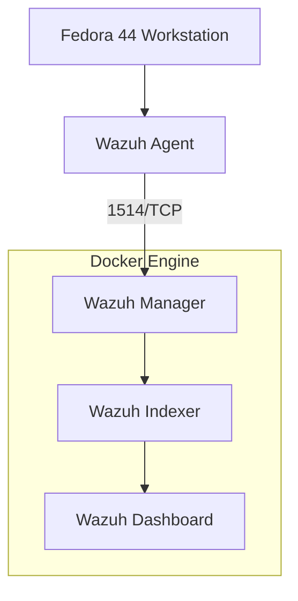
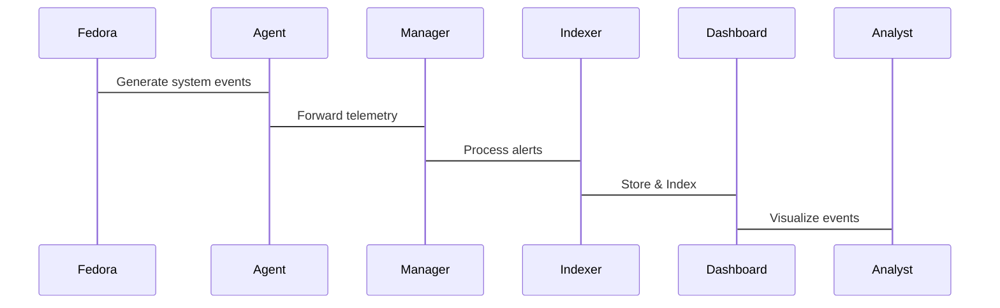

# 06 -Fedora Agent Enrollment

## Objective

This phase enrolls the Fedora workstation as the first managed endpoint within the SIEM platform. The objective is to establish secure communication between the endpoint and the Wazuh Manager, enabling continuous telemetry collection, endpoint monitoring, and security event analysis.

Successful enrollment transforms the deployment from a passive SIEM installation into an operational Security Operations Center (SOC) capable of monitoring endpoint activity in real time.

---

# Endpoint Architecture



---

# Endpoint Lifecycle

```text
Fedora Installation
        │
        ▼
Agent Installation
        │
        ▼
Manager Configuration
        │
        ▼
Agent Registration
        │
        ▼
Authentication
        │
        ▼
Telemetry Collection
        │
        ▼
Health Verification
        │
        ▼
Continuous Monitoring
```

---

# Environment

| Component              | Value                      |
| ---------------------- | -------------------------- |
| Endpoint               | Fedora Linux 44 KDE Plasma |
| Agent Version          | 4.9.2                      |
| Manager Version        | 4.9.2                      |
| Communication Protocol | TCP                        |
| Agent Service          | systemd                    |

---

# Why Install the Agent on the Host?

Although the Wazuh platform runs inside Docker containers, the agent is installed directly on the Fedora host.

This design allows the agent to monitor:

* Operating system logs
* Authentication events
* File Integrity Monitoring (FIM)
* Security Configuration Assessment (SCA)
* Installed packages
* Running processes
* System inventory
* Vulnerability information

Installing the agent on the host provides visibility into the operating system itself rather than the container environment.

---

# Version Compatibility

The platform was intentionally standardized on **Wazuh 4.9.2**.

Although newer agent packages were available from the default repository, the matching **4.9.2** agent was selected to maintain compatibility with the deployed Manager.

Maintaining consistent platform versions simplifies troubleshooting and aligns with production best practices.

---

# Installation Method

The official Wazuh repository was configured on Fedora.

Advantages of using the repository include:

* Package signature verification
* Dependency management
* Simplified upgrades
* Enterprise deployment workflow

---

# Agent Installation

The agent was installed while specifying the Manager address during installation.

```bash
sudo WAZUH_MANAGER="your-ip" dnf install wazuh-agent-4.9.2
```

This automatically configured the endpoint to communicate with the local Wazuh Manager.

---

# Configuration Validation

The generated configuration file was inspected before starting the service.

The Manager configuration included:

```xml
<server>
    <address>192.168.*.*2</address>
    <port>1514</port>
    <protocol>tcp</protocol>
</server>
```

Validating the configuration before startup reduces troubleshooting time and confirms that the endpoint will connect to the intended Manager.

---

# Service Management

The Wazuh Agent service was enabled and started using systemd.

```bash
sudo systemctl enable wazuh-agent
sudo systemctl start wazuh-agent
```

The service was configured to start automatically during system boot.

---

# Enrollment Verification

Agent logs were monitored during startup.

```bash
sudo tail -f /var/ossec/logs/ossec.log
```

Successful enrollment confirmed:

* Connection to the Manager
* Agent authentication
* Key exchange
* Secure communication
* Telemetry transmission

---

# Manager Validation

The Wazuh Manager successfully recognized the Fedora endpoint as an active managed agent.

The endpoint appeared in:

* Agent Inventory
* Dashboard
* Active Agent List

This confirmed successful enrollment and communication between the endpoint and the SIEM platform.

---

# Data Flow



---

# Security Considerations

Several security decisions were made during endpoint enrollment.

* Matching agent and manager versions were used.
* Communication occurs over the Wazuh protocol.
* Official repositories and packages were used.
* The Manager address uses the workstation's LAN IP, allowing future endpoints to connect without reconfiguration.
* The agent runs as a managed system service under systemd.

---

# Validation Checklist

| Validation Item                | Status |
| ------------------------------ | ------ |
| Repository Configured          | ✅      |
| Agent Installed                | ✅      |
| Version Compatibility Verified | ✅      |
| Manager Address Configured     | ✅      |
| Agent Service Running          | ✅      |
| Agent Registered               | ✅      |
| Dashboard Visibility           | ✅      |
| Telemetry Flow Confirmed       | ✅      |

---

# Lessons Learned

This phase highlighted several operational principles.

* Endpoint enrollment is the transition from infrastructure deployment to security monitoring.
* Matching agent and manager versions simplifies maintenance and troubleshooting.
* Repository-based package management provides a cleaner lifecycle than manual RPM installation.
* Validating configuration before starting services reduces operational issues.
* Monitoring agent logs provides immediate insight into enrollment and communication status.

---

# Outcome

At the conclusion of this phase:

* Fedora became the first managed endpoint.
* Secure communication with the Wazuh Manager was established.
* Endpoint telemetry began flowing into the SIEM.
* The endpoint became visible in the Wazuh Dashboard.
* The platform became ready for detection engineering, threat hunting, and incident response exercises.

---
